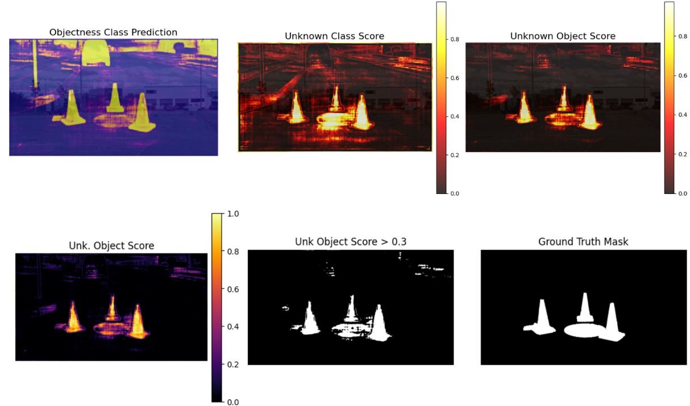

# Uncertainty-Aware Road Obstacle Identification

### Project Task

The aim of this project is to develop a general, model-agnostic framework for road obstacle identification based on semantic segmentation outputs with uncertainty awareness. The system focuses on anomaly-aware semantic segmentation to detect obstacles outside predefined classes. Additionally, the framework integrates uncertainty quantification using Conformal Prediction methods, providing formal statistical guarantees regarding detection reliability.

## Main Objectives

1. **Anomaly-Aware Obstacle Segmentation**: Integrate techniques within a semantic segmentation model to detect obstacles that fall outside known classes.
2. **Statistical Uncertainty Quantification**: Use conformal prediction methods to ensure reliable detection metrics.
3. **Comprehensive Evaluation**: Benchmark the system using both detection performance and uncertainty metrics.

## Pipeline

In this project we did 3 main tasks:

- **Train a model to recognize road obstacles**:We fine-tune a DeepLabv3 model with a ResNet50 backbone and a sigmoid head using the Cityscapes dataset, adapting it to urban driving scenarios from an autonomous vehicle’s perspective.

  - **Sigmoid head**: Allows to insert an object class and get independent probablilies per class
  - **Unknown Score**: Measures the degree to which a pixel is unlikely to belong to any known class.
  - **Objectness Class**: For each pixel, probability of being an object (merging all known object classes into one “object” class).
  - **Unknown Objectness Score (UOS)**: Multiply unknown and objectness class for each pixel.
    - **High UOS** = probably an unknown obstacle.
  - **Boundary Awareness**:
    - Boundarys were misunderstood and recognized as unknown, getting higher unknown score, even though they’re not objects. A new boundary aware loss function was implemented and the model was retrained.

- **Conformal Risk Control**: To further improve reliability, we implemented Conformal Risk Control, based on the papers Conformal Semantic Image Segmentation: Post-hoc Quantification of Predictive Uncertainty. and A Gentle Introduction to Conformal Prediction and Distribution-Free Uncertainty Quantification.

  - Combined with the _UOS_, conformal risk control provides a statistically valid thresholding mechanism when binarizing the unknown object score map.

  - We focus on controlling the False Negative Rate (FNR) as the risk function, enabling the user to specify a maximum acceptable rate of missed obstacle detections (i.e., obstacles wrongly classified as background). This ensures a quantifiable and reliable detection behavior in safety-critical road environments.

- **Evaluation**: We evaluated our method on the Lost and Found and Road Anomaly datasets using three key metrics: AUROC (Area Under the Receiver Operating Characteristic Curve), Average Precision (AP), and False Positive Rate at 95% True Positive Rate (FPR@95%TPR). These metrics provide a comprehensive assessment of both detection accuracy and reliability under uncertainty, and can be directly compared with the Road Obstacle Detection based on Unknown Objectness Scores paper.

## What we accomplished

We developed a functional and modular pipeline capable of training semantic segmentation models and generating Unknown Object Score (UOS) maps. Using Conformal Risk Control (CRC), we are able to set a user-defined tolerance for false negative rates, enabling statistically valid uncertainty-aware decision thresholds.

All main objectives of the project were successfully achieved:

- We integrated anomaly-aware obstacle segmentation via the UOS framework.

- We implemented Conformal Risk Control to provide statistical guarantees on detection reliability.

- We conducted a comprehensive evaluation using standard metrics on both Lost and Found and Road Anomaly datasets, following the same experimental setup as the guiding research papers.

While our current results are not yet competitive with state-of-the-art benchmarks, the pipeline proves to be robust and extensible. As future work, we plan to fine-tune the model on Lost and Found to improve performance and further validate our approach in real-world environments.

### Results

- Object detection on vehicles dataset
- Object detection using **_UOS_** with a threshold > 0.5
- Minimization of False Negatives using CRC

## How to Run

Google Colab was our choice to train our model for it's versatility and powerful processing units.

### Performance Warning:

If you want to execute these notebooks using Google Colab, you will need to upgrade to premium, since RAM and computing power exceeds free allowance.

Recommended setup for Google Colab:

- **Processing unit**: A100 (Colab Pro)
- **RAM**: CPU: 83 GB, GPU: 40 GB (Colab Pro)

### This project consists of 2 main Jupyter Notebooks

**UAROI_Training**: This is the first file to execute. Export the trained model.

- Training file for our model, capable of recognize and label objects from vehicle POV.
- Loads and prepares datasets
  - Uses _Cityscapes_ dataset.
- Defines the segmentation model
- Implements custom loss function
- Trains the segmentation model
- Performance heavy

**UAROI_Conformal_Risk_Control_Evaluation**: This is the second file. This notebook fine-tunes our model to find OoD objects on the road.

- Applies the model to each test image, extracting segmentation predictions, objectness maps, and unknown objectness scores.
- Displays thresholded unknown objectness score maps (binary mask).
  - Compares predictions to the ground-truth obstacle mask.
  - Applies Conformal Prediction / Risk Control:
  - Applies this threshold on new data for valid uncertainty-aware detection.
- Evaluates model performance

## Academic Papers

1. Noguchi, C., Ohgushi, T., & Yamanaka, M. (2024). Road Obstacle Detection based on Unknown Objectness Scores. arXiv [Cs.CV].
2. Mossina, L., Dalmau, J., & Andéol, L. (2024). Conformal Semantic Image Segmentation: Post-hoc Quantification of Predictive Uncertainty. arXiv [Cs.CV].
3. Angelopoulos, A. N., & Bates, S. (2022). A Gentle Introduction to Conformal Prediction and Distribution-Free Uncertainty Quantification. arXiv [Cs.LG].

## Datasets

1. Alok, S. (n.d.). _Cityscapes dataset_. Kaggle. [View](https://www.kaggle.com/datasets/shuvoalok/cityscapes)
2. Gehrig, S. (n.d.). _Lost and Found dataset_. DHBW Stuttgart. [View](https://wwwlehre.dhbw-stuttgart.de/~sgehrig/lostAndFoundDataset/index.html)
3. Fishyscapes. (n.d.). _Fishyscapes benchmark suite_. [View](https://fishyscapes.com/)
